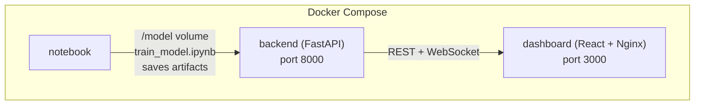

# NYC Bus Delay Prediction — ML Demo

A full-stack machine learning tutorial demonstrating how to build, deploy, and visualize a real-time **bus delay prediction system** using:

- **Random Forest** trained on the [NYC Bus Breakdown & Delays dataset](https://www.openml.org/search?type=data&status=active&id=43484)
- **FastAPI** backend serving predictions + real-time bus simulation via WebSocket
- **React** dashboard with an interactive map, live bus tracking, and ML predictions
- **Docker Compose** for one-command deployment

---

## Project Structure

```
traffic-ml-demo/
├── notebook/
│   ├── train_model.ipynb     ← ML training pipeline
├── backend/
│   ├── main.py               ← FastAPI: prediction API + bus simulator
│   ├── requirements.txt
│   └── Dockerfile
├── dashboard/
│   ├── src/
│   │   ├── App.jsx           ← React dashboard
│   │   └── index.js
│   ├── public/index.html
│   ├── package.json
│   ├── nginx.conf
│   └── Dockerfile
└── docker-compose.yml
```

---

## Architecture



**Shared volume `model_data`** bridges the notebook and backend — the notebook saves the trained model here, and the backend reads it at startup.

---

## Quick Start

### Start the Dashboard

```bash
docker compose up
```

---

## API Reference

Base URL: `http://localhost:8000`

| Method | Endpoint                | Description                         |
| ------ | ----------------------- | ----------------------------------- |
| `GET`  | `/health`               | Health check + model status         |
| `GET`  | `/routes`               | Bus route definitions and waypoints |
| `GET`  | `/model/info`           | Model metadata (features, classes)  |
| `GET`  | `/model/feature_schema` | Feature schema for prediction form  |
| `POST` | `/predict`              | Predict delay from raw features     |
| `POST` | `/predict/bus/{bus_id}` | Auto-predict for a simulated bus    |
| `WS`   | `/ws/buses`             | Real-time bus position stream       |

### Example Prediction Request

```bash
curl -X POST http://localhost:8000/predict \
  -H "Content-Type: application/json" \
  -d '{
    "features": {
      "Boro": "Manhattan",
      "Reason": "Heavy Traffic",
      "How_Long_Delayed": 20,
      "Number_Of_Students_On_The_Bus": 35,
      "Has_Contractor_Notified_Schools": "Yes",
      "Run_Type": "Special Ed AM Run"
    }
  }'
```

### WebSocket Bus Stream

Connect to `ws://localhost:8000/ws/buses` — you'll receive JSON messages every second:

```json
{
  "type": "bus_update",
  "buses": [
    {
      "bus_id": "BUS-001",
      "route_id": "M15",
      "lat": 40.75123,
      "lon": -73.98456,
      "passengers": 32,
      "delay_minutes": 8,
      "timestamp": 1712345678.9
    }
  ]
}
```

---

## Dashboard Features

- **Live map** — 4 simulated NYC bus routes (M15, M79, Q58, BX12) with real-time position updates
- **Bus selection** — click any bus marker or sidebar item to select it
- **Delay prediction** — runs the ML model every 5 seconds on the selected bus state
- **Probability gauge** — radial chart showing delay probability
- **Fleet summary** — aggregate stats across all buses

---

## Development (without Docker)

### Backend

```bash
cd backend
pip install -r requirements.txt
MODEL_DIR=./model uvicorn main:app --reload
```

### Dashboard

```bash
cd dashboard
npm install
REACT_APP_API_URL=http://localhost:8000 \
REACT_APP_WS_URL=ws://localhost:8000/ws/buses \
npm start
```

### Notebook

```bash
cd notebook
pip install jupyter openml scikit-learn pandas matplotlib seaborn joblib
jupyter notebook train_model.ipynb
```
